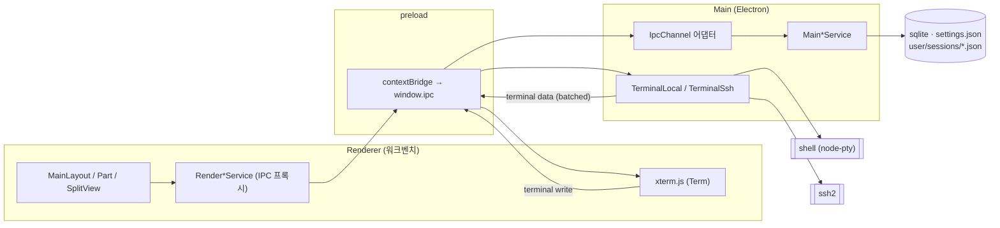
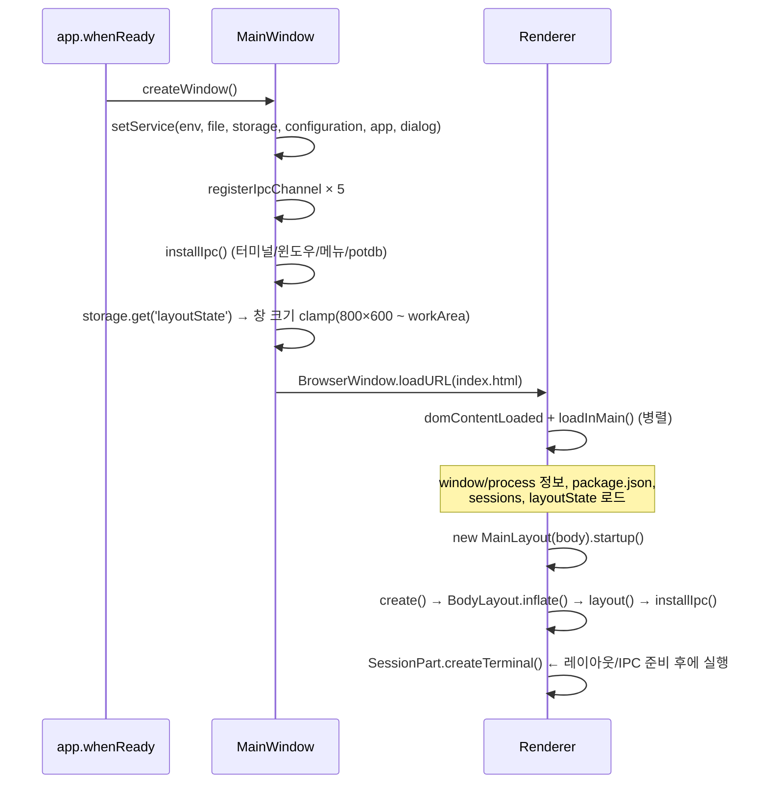

# crossterm — 프로젝트 개요

> 이 문서는 저장소 전체를 훑어서 정리한 구조/흐름/의도 요약본이다.
> 코드에서 확인한 **사실**과, 코드 흐름에서 유추한 **추론**을 구분해서 적었다.
> (기준: `v0.6.26`, `src/` 기준 TypeScript ~12.7k LOC, 커밋 415개 / 2024-08 ~ 2026-08)

---

## 1. 한눈에 보기

| 항목 | 내용 |
| --- | --- |
| 정체 | Electron 기반 **크로스플랫폼 터미널 앱** (로컬 shell + SSH) |
| 출발점 | `electron-react-boilerplate`에서 **React를 걷어낸** 껍데기 |
| UI | 프레임워크 없음. **VS Code 워크벤치 구조를 직접 이식**한 순수 DOM/TS |
| 터미널 | 렌더러 `xterm.js` ↔ 메인 `node-pty`(로컬) / `ssh2`(원격) |
| 영속화 | `sqlite3`(상태) + `settings.json`(설정) + `user/sessions/*.json`(세션 목록) + `potdb`(레거시) |
| 라이선스 | MIT |

한 문장으로: **"VS Code의 워크벤치 아키텍처를 손으로 다시 구현해보면서 만드는 터미널 앱"**.

---

## 2. 목표 (추론)

README에는 세 줄뿐이다 — *Crossplatform terminal app / Start with electron-react-boilerplate removing react / **Deep clone of vscode***.
코드를 보면 그 "deep clone"이 진짜 목표에 가깝다. 근거:

1. **제품 기능보다 구조가 훨씬 앞서 있다.**
   터미널 자체 기능(프로파일, 검색, 링크, 테마, 분할 저장)은 최소한인데,
   `SplitView` / `Sash` / `GridView` / `PaneView` / `Part` / `Layout` / `Emitter` / `Disposable` /
   `Queue` / `ContextKeyService` / `KeybindingResolver` 같은 VS Code 내부 인프라는 계속 늘어난다.
2. **VS Code 원본 파일 경로가 주석에 그대로 남아 있다.**
   예) `common/keybinding/keybindingService.ts` 상단 — *"`vs/platform/keybinding/common/abstractKeybindingService.ts` + `vs/workbench/services/keybinding/browser/keybindingService.ts`를 최소 형태로 합친 것"*, 그리고 **"원본과 비교해 의도적으로 뺀 것"** 목록까지 적혀 있다.
3. **같은 기능을 여러 번 다시 만든다.**
   `Panel` → `PaneView`/`Pane`, `GridView` → `SplitView` 직접 조립, `potdb` → `sqlite`,
   `ipcMain` 직접 호출 → `IpcChannel` 추상화. 커밋 로그도 "코드정리", "미사용코드 정리",
   "examine async queue more", "move q to async" 처럼 **리팩터링/학습형 커밋**이 큰 비중을 차지한다.

> **추론:** 이 프로젝트의 1차 목표는 "쓸 만한 터미널"이라기보다 **VS Code 아키텍처를 몸으로 익히는 것**이고,
> 터미널은 그 구조를 얹을 만큼 충분히 실전적이면서도 범위가 작은 도메인으로 고른 것으로 보인다.
> (참고: `README.md`가 참조 버전을 `microsoft/vscode 1.89.1, 1.124.2`로 명시. 작성자는 실제로 VS Code 소스를 옆에 두고 작업 중.)

---

## 3. 기술 스택 & 빌드 파이프라인

- **런타임**: Electron 31, Node ≥14, TypeScript 5.2 (`strict: false`)
- **번들러**: webpack 5 (main / preload / renderer 3벌 설정, `.erb/configs/`)
- **네이티브 모듈**: `release/app/package.json`에 격리 — `node-pty`, `sqlite3`, `ssh2`, `@vscode/codicons`
  (webpack `externals`로 빠지고 `electron-rebuild`가 ABI 리빌드)
- **테스트**: jest + ts-jest (jsdom 환경)
- **패키징**: electron-builder (mac dmg / win nsis / linux AppImage)

```
npm i         # postinstall: native dep 체크 → app-deps 설치 → dll 빌드
npm start     # 포트 체크 → main dev 번들 → renderer dev server(webpack-dev-server)
npm test      # jest
npm run package
```

빌드 산출물 흐름:

```
src/main/main.ts     --webpack--> .erb/dll/main.bundle.dev.js   (package.json "main")
src/main/preload.ts  --webpack--> .erb/dll/preload.js
src/renderer/index.ts--webpack--> dev server (index.ejs 템플릿)
```

---

## 4. 디렉토리 구조

```
src/
├── common/          ← main·renderer 양쪽에서 import 하는 공유 계층
│   ├── base/        ← lifecycle(Disposable), event(Emitter), async(Queue), platform, dialogs
│   ├── browser/     ← DomEmitter
│   ├── command/     ← CommandsRegistry / CommandService      (신규·미배선)
│   ├── contextkey/  ← ContextKeyService / ContextKeyExpr     (신규·미배선)
│   ├── keybinding/  ← Chord/Keybinding/Resolver/Registry     (신규·미배선)
│   ├── service/     ← 서비스 "인터페이스"만 정의 (File/Storage/Configuration/Environment/Dialog)
│   ├── ipc.ts       ← IPC 채널 이름의 단일 타입 정의 (MainEvents / RenderEvents)
│   ├── Types.ts     ← TerminalItem, ListItemElem, 메뉴 id 상수 등 도메인 타입
│   └── configs.ts   ← potdb 레거시 기본 설정 + 데모용 세션 목록
│
├── main/            ← Electron 메인 프로세스
│   ├── main.ts      ← MainWindow 클래스 + 앱 수명주기 + 다수의 ipcMain 핸들러
│   ├── preload.ts   ← contextBridge로 window.ipc 노출 (send/invoke/on/once/off)
│   ├── IpcChannel.ts← 서비스 → ipcMain 등록을 한 곳으로 모으는 어댑터
│   ├── ipc/         ← 서비스별 채널 어댑터 (App/File/Storage/Configuration/Dialog)
│   ├── service/     ← 서비스 "구현" (sqlite, fs, electron.dialog, app.getPath …)
│   ├── terminal/    ← TerminalBase → TerminalLocal(node-pty) / TerminalSsh(ssh2), DataBatcher
│   └── Menubar.ts   ← 네이티브 메뉴 템플릿
│
├── renderer/        ← 렌더러(워크벤치)
│   ├── index.ts     ← Renderer 부트스트랩 (메인에서 초기 상태 로드 → MainLayout.startup())
│   ├── Layout/Part/Pane/PaneView/Panel/Popup/Dialog/Component  ← 추상 기반 클래스
│   ├── component/   ← 재사용 위젯: SplitView, Sash, GridView, Grid, List
│   ├── layout/      ← MainLayout(세로 3분할) / BodyLayout(가로 3분할)
│   ├── part/        ← Titlebar, Activitybar, Sidebar, Session, Statusbar, Menubar
│   │   ├── tab/     ← Tab, Tabs
│   │   ├── term/    ← Term(xterm 래퍼), Terms
│   │   ├── view/    ← GroupView(탭+터미널 묶음), OrientationView(중첩 분할)
│   │   └── overlay/ ← DropOverlay, DropTarget (드래그 분할)
│   ├── pane/·paneView/ ← 사이드바 내용물 (ListPane=세션 트리, DetailPane, Bookmark…)
│   └── service/     ← 렌더러측 서비스 구현 (IPC 프록시 + 캐시)
│
└── globals.ts       ← 전역 가변 상태: 터미널 레지스트리 + 세션 분할 트리(wrapper.tree)
```

---

## 5. 프로세스 아키텍처



### 5.1 IPC 계약

채널 이름은 **`common/ipc.ts` 한 파일에 유니온 타입**으로 모여 있다 (`MainEvents` / `RenderEvents`).
호출 규약은 preload에서 정해진다 — **인자를 항상 배열 하나로 감싸서** 보낸다.

```ts
// preload.ts
send(channel, ...args)   → ipcRenderer.send(channel, args)      // ipcMain.on
invoke(channel, ...args) → ipcRenderer.invoke(channel, args)    // ipcMain.handle
on(channel, cb)          → 해제 함수를 return (contextBridge 제약 우회)
```

> `off`가 브리지 너머로 동작하지 않는 Electron 이슈([#45224](https://github.com/electron/electron/issues/45224))를
> `on()`이 dispose 함수를 돌려주는 방식으로 우회한 흔적이 주석에 남아 있다.

메인 쪽 등록은 두 갈래다:

| 방식 | 위치 | 성격 |
| --- | --- | --- |
| `ipcMain.on/handle` 직접 | `main.ts`의 `installIpc()` | 터미널·윈도우·메뉴·컨텍스트메뉴·potdb 설정 — **초기 코드** |
| `IpcChannel` 어댑터 | `main/ipc/*.ts` | File/Storage/Configuration/App/Dialog — **정리된 신 코드** |

`IpcChannel`의 설계 의도가 파일 첫 줄에 그대로 적혀 있다:
*"ipcMain을 아는 파일이 이 하나로 줄어드는 게 요점"* — 서비스가 Electron 없이도 생성 가능해야 테스트가 된다.
실제로 `registerIpcChannel()`은 **dispose 시 removeHandler**까지 해서 electronmon 리로드/테스트 재등록 시
"second handler" 예외를 막는다.

### 5.2 터미널 데이터 경로

```
pty/ssh chunk
  → DataBatcher (16ms 또는 200KB 단위로 병합, 앞에 uid 36자를 prefix)
  → 'terminal data' 브로드캐스트
  → MainLayout.installIpc(): raw.slice(0,36)=uid, raw.slice(36)=data
  → globals.terminals[uid].xterm.write(data)
```
반대 방향은 `xterm.onData → 'terminal write' {uid, data} → terminals.get(uid).write()`,
크기 변경은 `xterm.onResize → 'terminal resize' {uid, cols, rows}`.

배칭은 Hyper 터미널의 `DataBatcher`와 사실상 동일한 아이디어(IPC 횟수/GC 압력 감소)다.

---

## 6. 렌더러 UI 아키텍처

### 6.1 레이아웃 트리

```
MainLayout (SplitView, VERTICAL)
├── TitlebarPart      (34px, 커스텀 메뉴바 + macOS 트래픽라이트 오프셋)
├── BodyLayout        (fill_parent)  ← Layout이면서 동시에 SplitViewItemView
│   └── SplitView (HORIZONTAL)
│       ├── ActivitybarPart (39px)
│       ├── SidebarPart     (240px, PaneView 호스팅)
│       └── SessionPart     (fill_parent, 터미널 트리)
└── StatusbarPart     (17px)
```

핵심 계약은 `SplitViewItemView` 하나다. `Part`, `BodyLayout`, `GroupView`, `OrientationView`,
`Pane`, `GridView.BranchNode/LeafNode`가 전부 이 인터페이스를 구현한다:

```ts
element, size, sizeType('match_parent'|'fill_parent'|'wrap_content'),
minimumSize, maximumSize, border, sashEnablement,
layout(offset, size), onDidChange(sashEvent), doWhenVisible(visible)
```

> **관찰:** 이 게터/세터 블록(약 40줄)이 6개 클래스에 **복붙되어 있다**. VS Code라면 `Component`/`Part`
> 상속으로 흡수되는 부분인데, 여기서는 인터페이스 구현을 각자 반복한다.
> `sizeType`이라는 개념(안드로이드 `match_parent`/`wrap_content` 차용)은 VS Code에 없는 **작성자 고유 확장**이다.

### 6.2 Part 위의 두 번째 프레임워크: Pane / PaneView

사이드바 내부는 별도 계층이다.

```
SidebarPart
└── PaneView (SplitView, VERTICAL)   ← BookmarkPaneView / SamplePaneView
    ├── Pane (header 22px + body)    ← ListPane (세션 트리)
    └── Pane                         ← DetailPane
```
`Pane`은 접힘(`expanded`) 상태에 따라 `sashEnablement`를 스스로 꺼서, 접힌 pane 사이의 사시(sash)를
비활성화한다 — VS Code `PaneView`와 동일한 트릭.

### 6.3 세션(터미널) 영역 — 재귀 분할 모델

가장 특징적인 부분. 전역 `globals.ts`의 **`wrapper.tree`가 단일 진실 소스**다.

```ts
type Group = TerminalItem[];                    // 탭 묶음 하나 (= 한 화면)
interface SplitItem { mode?: 'horizontal'|'vertical'; list?: (SplitItem|Group)[] }
```

이 트리를 `SessionPart.renderTree()`가 DOM 뷰로 변환한다:

```
SplitItem(list.length > 1)  → OrientationView  (내부에 SplitView)
Group                       → GroupView        (Tabs + Terms)
```

```
wrapper.tree = { mode:'horizontal', list:[
  [ {uid:a1}, {uid:a2, selected, active} ],     ← GroupView (탭 2개)
  { mode:'vertical', list:[ [ {uid:b1} ], [ {uid:b2} ] ] }   ← 중첩 OrientationView
]}
```

**드래그 분할** (`DropOverlay`): 탭을 끌면 전 그룹에 오버레이가 뜨고, 마우스 위치를 3분할(가로)·
상하 절반(세로)으로 판정해 `GroupDirection.UP/DOWN/LEFT/RIGHT`를 정한다. 임계값 로직(20% 가장자리,
1/3 분할 존)과 ASCII 주석 다이어그램까지 VS Code `DropOverlay`에서 그대로 가져온 형태다.
드롭하면 **DOM이 아니라 `wrapper.tree`를 재구성**하고 → `BodyLayout.recreate()`로
`SessionPart`를 통째로 새로 만들어 다시 렌더한다.

> **추론:** "모델을 바꾸고 뷰를 다시 만든다"는 이 방식은 구현이 단순한 대신,
> 새로 만든 `Term`이 기존 xterm 인스턴스를 재사용해야 해서 `Terms.create()`에
> `if (item.term) { 기존 element 재부착 } else { 새로 만든다 }` 분기가 생겼다.
> 즉 **재조립 비용을 xterm 재사용으로 상쇄**하는 절충이다.

### 6.4 상태 전파 방식

선택/활성 상태는 이벤트가 아니라 **직접 메서드 호출 + 좌표 지정**으로 전달된다.

```ts
sessionPartService.controlStyle({depth, index, pos}, {selected, active})
// depth: 트리 깊이, index: 각 깊이의 자식 인덱스 배열, pos: 그룹 내 탭 위치
```
`utils.ts`의 `findActiveItem` / `findItemById` / `findSplitItemByGroup`이 이 좌표를 찾아준다.

> **관찰:** `SessionPart`에는 같은 재귀 순회가 4벌 있다 — `createTerminal_r`, `getServices_r`,
> `makeOverlayVisible_r`, `fit_r`, `controlStyle_r`. 방문자(visitor) 하나로 접을 수 있는 지점.

---

## 7. 서비스 계층 & DI

VS Code의 데코레이터 DI 대신 **문자열 키 서비스 로케이터**를 쓴다. main/renderer 각각 별도 레지스트리:

```ts
// main/Service.ts, renderer/Service.ts (구조 동일)
setService(storageServiceId, new MainStorageService(env, file));  // 생성 시 등록
getService(storageServiceId) as StorageService;                   // 사용처에서 캐스팅
```

인터페이스는 `common/service/`에, 구현은 프로세스별로 둔다:

| 인터페이스 | Main 구현 | Renderer 구현 |
| --- | --- | --- |
| `FileService` | `MainFileService` (fs, **원자적 쓰기**: tmp→fsync→rename) | `FileServiceImpl` (IPC 프록시, 일부 미구현) |
| `StorageService` | `MainStorageService` (sqlite `ItemTable(key,value)`) | `RenderStorageService` (**부팅 시 전량 캐시** 후 IPC 쓰기) |
| `ConfigurationService` | `MainConfigurationService` (`settings.json`, default←user 2계층 병합) | `RenderConfigurationService` (IPC + `configuration changed` 이벤트 수신) |
| `EnvironmentService` | `MainEnvironmentService` (`app.getPath('userData')`) | — |
| `DialogService` | `MainDialogService` (window별 `Queue`로 모달 직렬화) | — |
| — | `AppService` (`user/sessions` 재귀 스캔) | — |

`MainConfigurationService`는 VS Code 설계를 꽤 충실히 축소했다:
- 쓰기는 `Queue`로 직렬화 (동시 쓰기 파일 손상 방지)
- **기본값과 같아지면 user 설정에서 키를 제거** (VS Code와 동일 동작)
- 저장 후 `reload()` → `diffKeys()`로 바뀐 키만 계산 → `onDidChangeConfiguration` 발화
- 메인이 이벤트를 잡아 `webContents.send('configuration changed', change)`로 렌더러에 중계

---

## 8. 데이터 & 영속화 — 현재 3중 구조

| 저장소 | 위치 | 담는 것 | 상태 |
| --- | --- | --- | --- |
| **sqlite** | `userData/user/state.sqldb` | `layoutState` (창 크기, 사이드바 크기/표시, paneview 접힘·크기) | **현행** |
| **settings.json** | `userData/settings.json` | 사용자 설정 (default 병합) | **현행**(배선 완료, 실사용 키는 아직 없음) |
| **sessions dir** | `userData/user/sessions/**.json` | 세션(북마크) 목록. 폴더=트리 노드, 파일=세션 | **현행** |
| **potdb** | `userData/potdb/dict/cfg.json` | `initial_value`, `list` (구 설정/세션) | **레거시** — `config all/get/set/update` 핸들러가 아직 살아 있음 |

`common/configs.ts`의 하드코딩된 세션 목록(`a`~`x`, SSH `192.168.0.25` 등)은 potdb 시절의 시드 데이터이고,
지금 실제 목록은 `AppService.readSessionsDir()`가 디스크에서 읽어 `renderer.sessions`로 들어간다.

> **주의 (실사용 전 반드시):** SSH 비밀번호가 **평문**이다. `configs.ts`에 리터럴로 있고,
> 세션 JSON 스키마 주석에도 `password: string, // encrypted`라고 써 있지만 암호화는 미구현이다.

---

## 9. 실행 흐름

### 9.1 기동



`startup()` 끝에 `resize` 리스너를 달고, 100ms 디바운스로 `layoutState.window_size`를 sqlite에 저장한다.

### 9.2 종료

```
app.on('before-quit') → preventDefault()
  → webContents.send('app quit request')
  → 렌더러가 정리 후 send('app quit ready')
  → 메인: ipcDisposables.dispose(); isReadyToQuit = true; app.quit()
```
> **관찰:** 렌더러 핸들러는 현재 **아무것도 저장하지 않고** 곧바로 `app quit ready`를 보낸다
> (저장 코드는 주석 처리됨). 즉 `wrapper.tree`(열려 있던 탭/분할 구성)는 **재시작 시 복원되지 않는다.**
> `OrientationView`에 남은 `// TODO: serialize n deserialize ?` 주석이 같은 지점을 가리킨다.

---

## 10. 진행 중인 작업 (git 미추적 = 가장 최근 관심사)

`git status` 기준 아직 커밋되지 않은 세 디렉터리:

```
src/common/command/      commands.ts            CommandsRegistry, CommandService
src/common/contextkey/   contextkey.ts          ContextKeyExpr (and/or/not/equals, deserialize)
                         contextKeyService.ts   DOM data-keybinding-context 기반 스코프
src/common/keybinding/   keyCodes.ts            code → KeyName 매핑
                         keybindings.ts         Chord/Keybinding 파서 (mod, ctrlcmd, cmd …)
                         keybindingResolver.ts  chord 룩업 + when 절 평가
                         keybindingsRegistry.ts weight 기반 우선순위 (Core/Contrib/UserSetting)
                         keybindingService.ts   keydown capture → dispatch → command 실행
                         keybinding.test.ts
```

설계 흐름은 VS Code 그대로다:

```
keydown(capture) → Chord.fromKeyboardEvent → dispatch 문자열('ctrl+shift+alt+meta+key' 정규 순서)
  → event.target에서 위로 올라가며 가장 가까운 Context 탐색
  → KeybindingResolver
       NoMatchingKb      → 통과 (터미널이 키를 그대로 받음)
       MoreChordsNeeded  → chord 모드 진입(5초 타임아웃), preventDefault
       KbFound           → CommandService.executeCommand(id), preventDefault
```

> **핵심:** 이 레이어는 **아직 어디에서도 인스턴스화되지 않는다** (`src` 전체에서 `KeybindingService`/
> `CommandsRegistry` 사용처 0건). 완성된 부품을 먼저 만들어 두고 배선을 남겨둔 상태.
> 마지막 커밋이 `"TODO: think 'do when visible' more"`인 것과 합쳐 보면,
> **다음 마일스톤은 "키 입력 → 커맨드 → 액션" 파이프라인을 워크벤치에 연결하는 것**으로 읽힌다.
> 터미널 앱에서 이건 특히 까다로운 문제다 — 대부분의 키는 xterm이 먹어야 하므로
> `when` 절과 스코프(`data-keybinding-context`)가 실제로 필요해진다. 이미 그 대비가 되어 있다.

---

## 11. 테스트 & 개발 워크플로

- 테스트 7종: `MainStorage`, `MainConfiguration`, `MainFile`, `MainDialog`, `AppService`, `async(Queue)`, `keybinding`
  → **전부 main/common 계층**. 렌더러 UI는 테스트 없음 (수동 확인).
- 테스트가 가능한 이유가 곧 `IpcChannel` 분리의 설계 근거다 — 서비스가 `ipcMain`을 몰라서 순수 생성이 된다.
- `.vscode/launch.json`에 Electron Main / Renderer attach / Jest(현재 파일·이름·전체) 구성이 준비돼 있다.
- 코딩 스타일: 들여쓰기 2칸, `else if` 체인, 큰 주석 블록으로 이전 버전 코드를 남겨두는 습관
  (`MainLayout`의 `createParts`/`createGridDescriptor` 전체가 주석으로 보존되어 있음 — GridView 방식에서
  SplitView 직접 조립 방식으로 갈아탄 이력).

---

## 12. 정리 — 강점 / 부채 / 다음 스텝

### 잘 되어 있는 것
- **계층 분리가 실제로 지켜진다.** `common`은 Electron을 (Dialog 타입 제외) 모른다. 서비스 인터페이스/구현 분리도 일관적.
- **`IpcChannel` 추상화**가 IPC 등록/해제와 테스트 가능성을 동시에 해결했다.
- **원자적 파일 쓰기**(tmp → fsync → rename)와 **쓰기 큐 직렬화** 등, 데이터 안전성에 대한 감각이 있다.
- **`SplitView`/`Sash` 재구현이 중첩 분할까지 실제로 동작**한다 — 이 프로젝트에서 가장 어려운 부분을 통과했다.
- 신규 코드일수록 **한국어 JSDoc으로 "원본 대비 뺀 것"까지 명시**되어 있어 의도 추적이 쉽다.

### 남은 부채 (우선순위 순, 주관)
1. **세션 트리 영속화 없음** — 종료 시 `wrapper.tree` 저장 / 기동 시 복원. 체감 효과가 가장 크다.
2. **SSH 비밀번호 평문** — `safeStorage`(Electron) 또는 OS 키체인으로 이관.
3. **설정 저장소 3중화** — `potdb`(`config *` 핸들러 4개 + `common/configs.ts`) 제거 후 sqlite/settings.json으로 일원화.
4. **미배선 keybinding/command/contextkey** — 배선하면서 `main.ts`의 `window fn`(문자열로 메서드 호출)과
   메뉴 클릭 경로를 커맨드 id로 흡수하면 중복이 줄어든다.
5. **`main.ts` 비대화(536줄)** — `installIpc()`의 터미널/윈도우/메뉴 핸들러를 `TerminalServiceChannel`,
   `WindowServiceChannel` 등으로 옮기면 `IpcChannel` 패턴이 완결된다.
6. **`SplitViewItemView` 보일러플레이트 6중복** / **`SessionPart` 재귀 5중복** — 기반 클래스 + 방문자로 축약 가능.
7. **`electron-builder` 설정이 보일러플레이트 그대로** — `productName: "ElectronReact"`, `appId: "org.erb.ElectronReact"`,
   `publish`가 `electron-react-boilerplate` 저장소를 가리킨다. 패키징 전에 반드시 교체.
8. **잔여 견고성 이슈** — `ipcMain.on('terminal resize')`가 `terminals.get(uid)`를 널 체크 없이 호출,
   `TerminalLocal`이 `options.shell`/`cwd`를 무시하고 `bash`/`cmd.exe` 하드코딩, `tsconfig` `strict` 비활성.

### 다음 스텝 제안 (한 문단)
> 지금 상태에서 **"쓸 수 있는 앱"으로 넘어가는 최단 경로**는 (1) 세션 트리 직렬화/복원,
> (2) 비밀번호 안전 저장, (3) potdb 제거 세 가지다. 반대로 **"VS Code 클론"이라는 원래 목적**을 이어간다면
> 이미 다 만들어 둔 keybinding/command/contextkey를 워크벤치에 배선하고, 그 김에 메뉴바·컨텍스트메뉴·
> 탭 액션을 전부 커맨드 id 경유로 바꾸는 편이 구조적 이득이 가장 크다. 둘은 배타적이지 않다 —
> 커맨드 배선을 먼저 하면 "세션 저장/복원"도 자연스럽게 커맨드로 붙는다.

---

## 부록 A. 파일 지도 (자주 찾게 되는 것들)

| 하고 싶은 일 | 볼 파일 |
| --- | --- |
| 앱 기동 순서 | [src/main/main.ts](src/main/main.ts) `createWindow()`, [src/renderer/index.ts](src/renderer/index.ts) |
| IPC 채널 추가 | [src/common/ipc.ts](src/common/ipc.ts) → [src/main/ipc/](src/main/ipc/) → [src/main/IpcChannel.ts](src/main/IpcChannel.ts) |
| 레이아웃 구조 변경 | [src/renderer/layout/MainLayout.ts](src/renderer/layout/MainLayout.ts), [src/renderer/layout/BodyLayout.ts](src/renderer/layout/BodyLayout.ts) |
| 분할/리사이즈 동작 | [src/renderer/component/SplitView.ts](src/renderer/component/SplitView.ts), [src/renderer/component/Sash.ts](src/renderer/component/Sash.ts) |
| 터미널 분할 모델 | [src/globals.ts](src/globals.ts), [src/renderer/utils.ts](src/renderer/utils.ts), [src/renderer/part/SessionPart.ts](src/renderer/part/SessionPart.ts) |
| 드래그 분할 | [src/renderer/part/overlay/DropOverlay.ts](src/renderer/part/overlay/DropOverlay.ts) |
| 터미널 백엔드 | [src/main/terminal/](src/main/terminal/) |
| 사이드바 트리 | [src/renderer/component/List.ts](src/renderer/component/List.ts), [src/renderer/pane/ListPane.ts](src/renderer/pane/ListPane.ts) |
| 설정 읽기/쓰기 | [src/main/service/MainConfigurationService.ts](src/main/service/MainConfigurationService.ts) |
| 상태(창 크기 등) 저장 | [src/main/service/MainStorageService.ts](src/main/service/MainStorageService.ts), [src/renderer/service/RenderStorageService.ts](src/renderer/service/RenderStorageService.ts) |
| 키바인딩(미배선) | [src/common/keybinding/](src/common/keybinding/) |

## 부록 B. 용어

| 용어 | 뜻 (이 저장소 기준) |
| --- | --- |
| **Part** | 워크벤치의 최상위 UI 영역 (Titlebar/Activitybar/Sidebar/Session/Statusbar) |
| **Pane / PaneView** | 사이드바 안의 접히는 섹션과 그 컨테이너 |
| **Group** | 한 화면을 공유하는 터미널 탭 묶음 (`TerminalItem[]`) |
| **SplitItem** | 분할 노드. `mode`(가로/세로) + `list`(SplitItem 또는 Group) |
| **GroupView / OrientationView** | Group / SplitItem에 대응하는 DOM 뷰 |
| **Sash** | 두 뷰 사이의 드래그 리사이즈 핸들 |
| **sizeType** | `match_parent` / `fill_parent` / `wrap_content` — 작성자 고유의 크기 정책 |
| **Chord** | 키 조합 1회 (`ctrl+k`). 시퀀스가 Keybinding (`ctrl+k ctrl+s`) |
